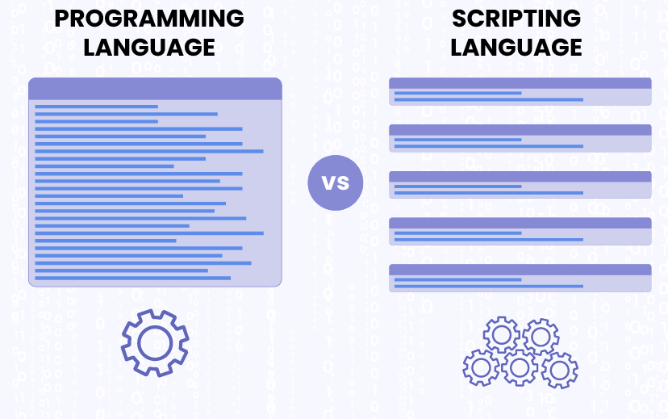

# Tech 258 - Scripting

## What is scripting? How is it different to programming?
Just like programming, scripting is a way of providing instructions to a computer, so you can tell it what to do and when to do it, commonly through a scripting language e.g Python and Bash. However, it is different from programming in many ways:
- **Characteristic of Language used**: Scripting often prioritises ease of use, readability and flexibility. Simpler syntaxn and semantics when compared to the majority of programming languages.
- **Scope**: Scripting typically involves writing small programs to automate specific tasks.


## What are the packages in the standard Python library? Show some code examples of them being used in code blocks within your markdown
Python comes with a high level of out-of-the-box support in terms of libraries, which provide a wide range of modules and packages for various tasks. Some examples:

- **datetime**: A library used to manipulate dates and times.
```python
import datetime
print(f"Today's date is: {datetime.datetime.today()}") # Shout print today's date
```

- **math**: A library that offers mathematical functions and constants for performing arithmetic calculations.
```python
import math
print(math.pi) # Should print the value of pi
```

- **random**: A library that allows for the generation of random numbers.
```python
import random
print(random.randrange(1, 11)) # Should print a random number from 1-10
```

- **os**: A library that provides a portable way of using operating system-dependent functionality.
```python
import os
working_dir = os.getcwd()
print(f"Current working directory is: {working_dir}") # Should print the present working directory (pwd).
```

## List at least 10 Python scripts a DevOps engineer may use/create. Here's an example, a script to query a database.
Some example scripts a DevOps engineer may create could be:
- A script that can read/write files.
- A script that allows interaction with APIs
- A script that can reformat an image.
- A script that can organise data.
- A script that can use web scraping.
- A script that can automate a CI/CD pipeline.
- A script that can provision and configure infrastructure.
- A script that can back up/restore files.
- A script that can monitor an application.
- A script that can automate security scanning.

## Example Script:
```bash
#!/bin/bash
echo "Hello, world!" # Should print a greeting message
echo "The current date and time is: $(date)" # Should print the current date and time
echo "Files in the current directory:" 
ls # Should list files in the current directory
```